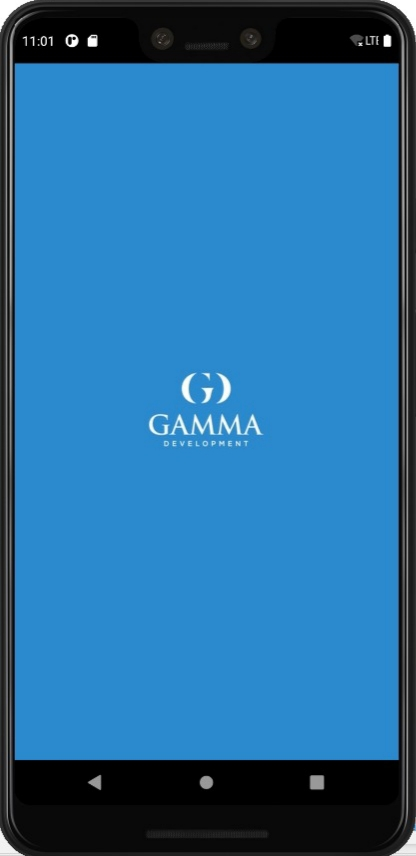
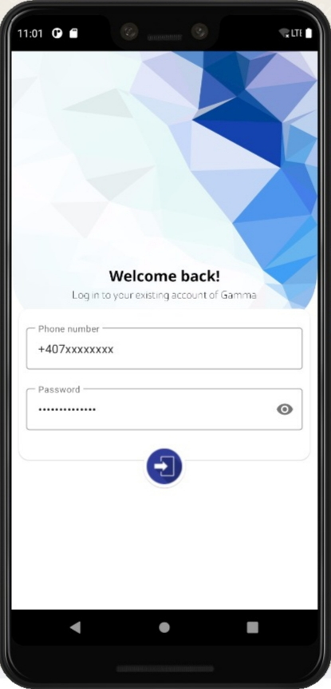
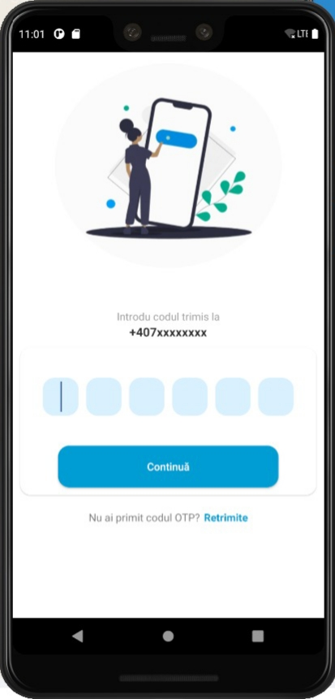

# APLICAŢIE INFORMATICĂ DE MOBILE BANKING
Proiectul de licență constă într-o aplicație de mobile banking care își propune, în primul rand, să ofere utilizatorilor opțiunea de a accesa de la distanță, din confortul casei lor, produse și servicii bancare esențiale, dar cuprinde și funcționalități unice, pe lângă o interfață atractivă, prietenoasă și, în același timp, foarte intuitivă și ușor de folosit pentru orice utilizator chiar de la prima accesare.

## Prezentarea generală
Temă -> Tema lucrării de licenţă constă într-o aplicație de mobile banking care face experiența de utilizare foarte plăcută prin prisma faptului că are o interfață atractivă, prietenoasă și, în același timp, foarte intuitivă și ușor de folosit pentru orice utilizator.  

Motivație -> Motivația alegerii temei este pasiunea către domeniul financiar-economic și, totodată, conștientizarea reticenței în ceea ce privește tranziția de la fizic la sistemul aproape 100% online din România.  

Scop -> Aplicația dezvoltată și implementată pentru această lucrare de licenţă a fost gândită în aşa fel încât să îndeplinească anumite nevoi tocmai cu scopul de a încuraja populația să adopte mai ușor digitalizarea bankingului.

## Tehnologiile utilizate
֍ Mediul de dezvoltare - Android Studio
֍ Limbajul de programare – **Java**
֍ Baza de date - Cloud Firestore

Aplicația este dezvoltată în limbajul *Java* cu ajutorul mediului de dezvoltare *Android Studio*, și este cuplată la o bază de date NoSQL, *Cloud Firestore*, care se actualizează concomitent cu acțiunile efectuate în cadrul aplicației. 

## Prezentarea aplicației - funcționalități și utilizare
#### LOGIN PAGE
La deschiderea aplicației se lansează în execuție fereastra de Login, unde utilizatorul se autentifică folosind numărul său de telefon, pe care primește prin SMS un cod de verificare generat automat, aici fiind utilizat Firebase Authentication. Autentificarea OTP (One Time Password) este o metodă prin care se asigură faptul că informațiile tale, ca și utilizator, sunt mereu în siguranță și că numai tu ai acces la ele, conferind un nivel mai înalt de securitate decât autentificarea clasică.
#### HOME PAGE
Odată permis accesul în aplicație, se deschide fereastra principală a meniului, Home, afișând utilizatorului informațiile prioritare despre contul său, și anume: soldul curent și principalele informații de securitate despre card. Acestea inițial sunt ascunse, dar pot fi făcute vizibile apăsând butonul cu pictograma în formă de ochi. 

Funcționalitățile puse la dispoziție utilizatorului:  

*SECȚIUNEA CARD:*  
֍ informațiile de pe card (numărul de card, data expirării, codul de securitate etc.), alături de posibilitatea de a le ascunde sau de a le face iar vizibile prin apăsarea unui buton  
֍ la o apăsare scurtă pe înfățișarea cardului sunt afișate într-o fereastră de tip pop-up toate retragerile și depunerile realizate la bancomate, pe când la o apăsare mai lungă sunt afișate informațiile necesare pentru realizarea unui transfer bancar, și anume: IBAN, numele complet al posesorului, monedă și bancă, oferindu-se și posibilitatea de a le copia automat în clipboard la apăsarea unui buton specific  
֍  o altă serie de acțiuni destinate cardului:  
1.	blocarea, respectiv deblocarea - atunci când cardul este blocat, pictograma în formă de ochi este schimbată cu o imagine care sugerează acest lucru (cardul cu lăcățel), și, mai mult decât atât, nu se va mai putea accesa fereastra destinată inițierii unui transfer, întrucât, în cazul în care o persoană neautorizată reușește să acceseze contul utilizatorului, aceasta să nu poată efectua transferuri, adică să nu aibă posibilitatea de a trimite o suma de bani din contul acestuia într-un alt cont;  
2.	vizualizarea PIN-ului direct din aplicație – la apăsarea pe “View PIN” se deschide o altă fereastră în care este solicitat CVV-ul, se introduce, se apăsă butonul și afișează PIN-ul.  

*SECȚIUNEA SOLD:*  
֍ soldul curent al contului bancar principal.  

*SECȚIUNEA DEPOZITE:*  
֍ la apăsarea pe “Deposits” se deschide un pop-up care  are rolul de a înștiința utilizatorul care este scopul unui depozit la termen;  
֍ la apăsarea succesivă a săgeții din dreptul secțiunii aferente depozitelor, acestea sunt afișate sau ascunse;  
֍ pentru a închide un depozit, utilizatorul trebuie să gliseze pe ecran în dreptul depozitului respectiv spre stânga ca să poată face vizibilă această opțiune; este solicitat consimțământul utilizatorului printr-o întrebare de securitate afișată într-o fereastră pop-up înainte de a fi finalizată acțiunea;  
֍ utilizatorul poate deschide un nou depozit de economii apăsând butonul „+”, iar când acesta este declanșat, se va deschide o fereastră cu un formular de completat; există un câmp din care se poate alege contul, căci utilizatorul mai poate avea deschis și un cont în EURO sau o altă monedă, apoi se introduc date precum denumirea depozitului, perioada și suma, iar rata dobânzii este calculată de aplicație în funcție de suma și durata depozitului, dar doar după ce cele două au fost completate.  

#### TRANSACTIONS PAGE
Fereastra Tranzacții afișează o lista completă a tranzacțiilor din istoricul salvat în baza de date, cu posibilitatea de a filtra și sorta informațiile primite după multiple criterii specifice. Inițial, sunt afișate doar tranzacțiile în interfață, dar la apăsarea celor două butoane corespunzătoare pentru sortare (crescătoare sau descrescătoare, în funcție de suma de bani), respectiv filtrare (o dată calendaristică specifică, venituri/cheltuieli, facturi și, respectiv, printr-o casetă de căutare prin care pot fi regăsite toate tranzacțiile a căror denumire conține șirul de caractere căutat de utilizator), vor fi expuse două module cu mai multe butoane, alături de o casetă de căutare. Pentru a servi cât mai bine nevoilor utilizatorilor, cele două module de sortare și filtrare funcționează 100% sincronizat și concomitent, fiind posibilă selectarea mai multor filtre în același timp.
Alte funcționalități disponibile:  
֍ la click pe o tranzacție specifică se pot vedea informații despre aceasta;  
֍ la apăsarea butonului „Extras de cont” se deschide un dialog personalizat în cadrul căruia utilizatorul setează perioada de timp dorită; în cazul în care există tranzacții efectuate în acea perioadă, ele vor listate într-un document Excel care se generează în momentul cu pricina și care este salvat mai întâi în memoria externă a telefonului, iar ulterior, acest fișier Excel care conține toate informațiile extrasului de cont este trimis în mod automat pe emailul utilizatorului;  dacă nu există tranzacții în perioada de timp selectată, utilizatorul primește un mesaj de notificare.  

#### PAYMENTS PAGE
Fereastra Plăți este locul în care pot fi inițiate transferuri bancare către diverși beneficiari și presupune un formular în care trebuie completate datele destinatarului, suma de plată și diverse detalii legate de descrierea plății. La bifarea căsuței „Plătește o factură de utilități”, aplicația îi pune la dispoziție utilizatorului o listă cu furnizorii de utilități disponibili deja în baza de date, scopul fiind ca acesta să nu mai fie nevoit să completeze manual datele de transfer.

#### REPORTS PAGE
Este bine cunoscut faptul că populația majoritară din România nu dispune de cunoștințele de bază legate de educație financiară și de întocmirea adecvată a unui buget personal sau de familie. De aceea, în cadrul aplicației a fost întrevăzută o **caracteristică specială care să vină în sprijinul utilizatorului în ceea ce privește gestionarea mai eficientă a bugetului**. Astfel, aplicația de față se diferențiază de celelalte aplicații similare disponibile pe piață în prezent prin faptul că îi pune la dispoziţie utilizatorului rapoarte grafice lunare, construite per categorii, pe baza istoricului cheltuielilor, menite să îl ajute să deslușească mai facil maniera în care sunt distribuiți și cheltuiți banii săi de-a lungul timpului.

La deschiderea ferestrei este reprezentat graficul general, care oferă o imagine de ansamblu pe baza întregului istoric de cheltuieli, iar mai apoi utilizatorul poate solicita vizualizarea graficelor aferente fiecărei luni în parte. Chiar daca acest ecran este destinat cheltuielilor, în josul ferestrei se regăsesc și încasările cu scopul de a putea pune în balanță raportul încasări-cheltuieli.

֍ generarea unui grafic interactiv de tip PieChart cu toate cheltuielile din istoricul de tranzacții organizate pe categorii principale;  
֍ generarea graficului pe întreg istoricul cheltuielilor sau doar pe luna selectată;  
֍ la click pe o anumită categorie se pot vedea clar cheltuielile corespunzătoare.  

## Capturi de ecran din interfață
#### Login page

#### Home page

#### Transactions page

#### Payments page

#### Reports page

